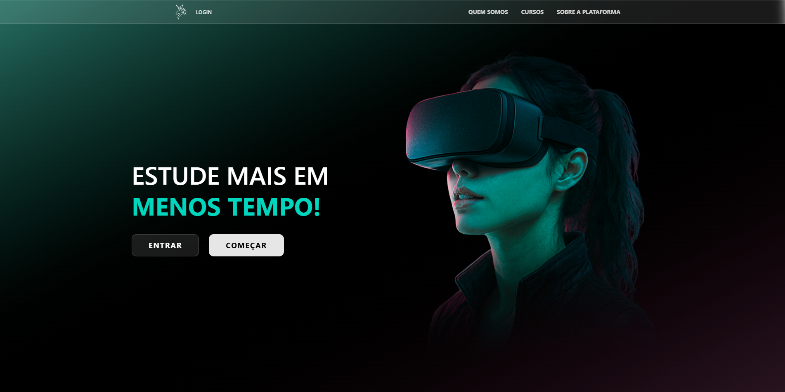

# 🧙‍♂️ MagiTech – Plataforma de Cursos Gamificada com VR (TCC)

## 📌 Sobre o Projeto
O **MagiTech** é uma **plataforma de cursos online gamificada**, desenvolvida como **Trabalho de Conclusão de Curso (TCC)**, com foco em **educação prática, imersiva e de baixo custo de manutenção**.

O principal diferencial da plataforma é a integração de um **módulo “mão na massa” em Realidade Virtual (VR)**, permitindo que o aluno pratique os conhecimentos adquiridos em um **ambiente virtual gamificado**, seguro e interativo.

---

## 🎯 Objetivo do Projeto
- Criar uma plataforma educacional **gamificada**
- Tornar o aprendizado mais **prático e envolvente**
- Reduzir custos de infraestrutura física
- Integrar **tecnologia web + realidade virtual**
- Aplicar conhecimentos técnicos adquiridos ao longo do curso
- Simular um produto com potencial de uso real no mercado

---

## 💡 Problema que o MagiTech Resolve
Cursos técnicos e profissionalizantes frequentemente enfrentam:
- Falta de prática real
- Alto custo com laboratórios físicos
- Baixo engajamento dos alunos
- Dificuldade em simular ambientes reais com segurança

O **MagiTech** resolve esse problema ao oferecer uma **experiência prática em VR**, onde o aluno pode errar, aprender e repetir quantas vezes precisar, sem riscos e sem custos adicionais.

---

## ⚙️ Como a Plataforma Funciona
1. O aluno acessa a plataforma web
2. Assiste às aulas teóricas normalmente
3. Responde quizzes para reforço do conteúdo
4. No módulo prático, entra em um **ambiente de realidade virtual gamificado**
5. Nesse ambiente, o aluno executa tarefas práticas relacionadas ao curso

---

## 🧠 Módulo de Realidade Virtual (Diferencial do Projeto)
O módulo de VR foi desenvolvido para o **curso de crimpagem de cabos**.

Dentro do ambiente virtual:
- O aluno interage com um cenário 3D imersivo
- Realiza a **simulação de crimpagem de cabos**
- Utiliza objetos virtuais como se estivesse em um laboratório real
- Aprende de forma prática, segura e gamificada

Esse módulo transforma o aprendizado técnico em uma **experiência ativa**, reforçando o conteúdo estudado em aula.

---

## 🛠️ Tecnologias Utilizadas – Plataforma Web

- **Visual Studio Code (VSCode)**  
  Editor de código utilizado para escrever e organizar o projeto, funcionando como um “Word” para programadores.

- **Windsurf**  
  Ferramenta com inteligência artificial utilizada para auxiliar na escrita, organização e correção de código, acelerando o desenvolvimento.

- **React**  
  Biblioteca JavaScript usada para criar interfaces modernas, dinâmicas e organizadas.

- **Vite**  
  Ferramenta de build e desenvolvimento rápido, tornando o projeto mais leve e ágil para criar e testar.

- **Tailwind CSS**  
  Framework de estilos utilitários que permite criar layouts modernos sem escrever CSS do zero.

- **Firebase**  
  Serviço em nuvem utilizado para autenticação, banco de dados e funcionalidades essenciais da plataforma.

- **GitHub**  
  Plataforma de hospedagem de código, versionamento e colaboração em equipe usando Git.

- **Square Claude (Cloud Services)**  
  Serviços em nuvem utilizados para criar, hospedar e gerenciar APIs, bancos de dados e infraestrutura da aplicação.

- **C#**  
  Linguagem de programação utilizada no desenvolvimento das APIs da plataforma.

- **Neon (PostgreSQL Serverless)**  
  Banco de dados PostgreSQL serverless, com escalabilidade automática, fácil configuração e suporte a ambientes de desenvolvimento modernos.

---

## 🛠️ Tecnologias Utilizadas – Realidade Virtual (VR)

- **Unity Engine**  
  Plataforma utilizada para o desenvolvimento da gamificação em VR, permitindo criar ambientes 3D interativos e experiências imersivas.

- **Visual Studio**  
  Ambiente de desenvolvimento utilizado para programar e depurar os scripts em C# integrados à Unity.

- **C# (Unity Scripting)**  
  Linguagem utilizada para controlar interações, lógica do ambiente e comportamento dos objetos no VR.

- **Autodesk Maya**  
  Software profissional de modelagem e animação 3D utilizado para criar todos os ativos do projeto.

---

## 🎨 Desenvolvimento 3D e Imersão
Toda a parte de **desenvolvimento 3D** foi pensada para ampliar a **imersão do usuário**, tanto no ambiente quanto na interação com os objetos.

- Todos os modelos 3D foram **criados pela própria equipe**
- Nenhum asset pronto da internet foi utilizado
- Garantia de **identidade visual exclusiva**
- Modelos desenvolvidos com foco em **realismo e fidelidade**
- Integração completa com a Unity Engine para renderização, físicas e interação em tempo real

---

## 🖥️ Funcionalidades da Plataforma
- Plataforma web de cursos
- Aulas teóricas online
- Quizzes interativos
- Módulo prático em Realidade Virtual
- Gamificação do aprendizado
- Integração entre web, APIs e VR
- Estrutura escalável e moderna

## 📚 Aprendizados
- Desenvolvimento de uma plataforma completa
- Integração entre front-end, back-end e VR
- Uso de tecnologias modernas do mercado
- Criação de APIs
- Modelagem e desenvolvimento 3D
- Gamificação aplicada à educação
- Trabalho em equipe e organização de projeto
- Planejamento e execução de um TCC técnico

---

## 🎓 Contexto Acadêmico
Este projeto foi desenvolvido como **Trabalho de Conclusão de Curso (TCC)**, representando a consolidação dos conhecimentos técnicos adquiridos ao longo da formação, com foco em inovação, prática e aplicação real de tecnologia educacional.

==================================================

# 🧙‍♂️ MagiTech – Gamified Learning Platform with VR (Final Course Project)

## 📌 About the Project
**MagiTech** is a **gamified online learning platform** developed as a **Final Course Project (TCC)**, focused on providing **practical, immersive, and low-maintenance-cost education**.

The platform’s main differentiator is a **hands-on Virtual Reality (VR) module**, allowing students to practice what they learned in a **safe, interactive, and gamified virtual environment**.

---

## 🎯 Project Goal
- Build a **gamified educational platform**
- Increase student engagement through practice
- Reduce physical infrastructure costs
- Integrate **web technologies with virtual reality**
- Apply academic knowledge in a real-world project
- Simulate a market-ready product

---

## 🧠 VR Hands-on Module (Key Differentiator)
The VR module was developed for a **cable crimping course**.

Inside the virtual environment, students:
- Interact with immersive 3D scenarios
- Perform cable crimping simulations
- Use virtual tools as in a real lab
- Practice safely and repeatedly

This approach makes learning **more effective, engaging, and motivating**.

---

## 🛠️ Technologies Used

### Web Platform
- React
- Vite
- Tailwind CSS
- Firebase
- GitHub
- Cloud Services (Square Claude)
- C#
- Neon (PostgreSQL Serverless)
- Visual Studio Code
- Windsurf (AI-assisted development)

### Virtual Reality
- Unity Engine
- Visual Studio
- C#
- Autodesk Maya

---

## 🎨 3D Development
All 3D assets were **fully created by the team**, without using external assets, ensuring:
- Exclusive visual identity
- High realism
- Professional-quality models
- Full control over immersion and interaction

---

## 🎓 Academic Context
This project was developed as a **Final Course Project (TCC)**, demonstrating technical proficiency, innovation, and the ability to integrate multiple technologies into a cohesive educational solution.
